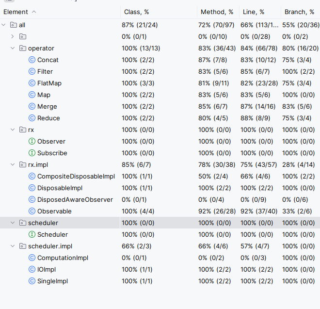

## Описание проекта
Проект представляет собой реактивную систему обработки потоков событий , построенную на паттерне «Наблюдатель» (Observer). В нём реализованы:
* Базовые компоненты: Observable, Observer, Disposable.
* Операторы для преобразования и объединения потоков.
* Планировщики потоков (Scheduler), управляющие выполнением задач в разных потоках.
* Поддержка отмены подписок, логгирование через Log4j.

## Стек
- Java 17+
- Maven — сборка и управление зависимостями
- Log4j — логгирование
- JUnit 5 — тестирование

## Структура проекта
```plaintext
├── pom.xml
├── ReadMe.md
└── src/
    ├── main/
    │   ├── java/
    │   │   ├── dn/
    │   │   │   ├── dn.operator
    │   │   │   │   ├── Concat.java
    │   │   │   │   ├── Filter.java
    │   │   │   │   ├── FlatMap.java
    │   │   │   │   ├── Merge.java
    │   │   │   │   └── Reduce.java
    │   │   │   ├── dn.rx
    │   │   │   │   ├── Observer.java
    │   │   │   │   ├── Subscribe.java
    │   │   │   │   └── impl
    │   │   │   │       ├── CompositeDisposableImpl.java
    │   │   │   │       ├── DisposableImpl.java
    │   │   │   │       ├── DisposedAwareObserverImpl.java
    │   │   │   │       └── Observable.java
    │   │   │   ├── dn.scheduler
    │   │   │   │   ├── Scheduler.java
    │   │   │   │   └── impl
    │   │   │   │       ├── ComputationImpl.java
    │   │   │   │       ├── IOImpl.java
    │   │   │   │       └── SingleImpl.java
    │   │   │   └── dn.Main.java
    │   │   └── resources/
    │   │       └── log4j.properties
    │   └── test/
    │       └── java/
    │           ├── ObservableTest.java
    │           ├── OperatorTest.java
    │           └── SchedulerTest.java
```

## Основные возможности
### Компоненты
* [Observable.java](src/main/java/rx/impl/Observable.java) - Источник данных. Методы:
* * create()
* * just()
* [Observer.java](src/main/java/rx/Observer.java) Интерфейс потребителя с методами:
* * onNext()
* * onError()
* * onComplete()

### Операторы
Расположены в пакете operators:
* [Map.java](src/main/java/operator/Map.java) - Преобразует каждый элемент потока
* [Filter.java](src/main/java/operator/Filter.java) - Отбирает элементы по условию
* [FlatMap.java](src/main/java/operator/FlatMap.java) - Преобразует элементы в новые потоки
* [Merge.java](src/main/java/operator/Merge.java) - Объединяет несколько потоков
* [Concat.java](src/main/java/operator/Concat.java) - Последовательно объединяет потоки
* [Reduce.java](src/main/java/operator/Reduce.java) - Сворачивает поток в одно значение

### Планировщики (Schedulers)
Позволяют управлять потоками выполнения:

- [IOImpl.java](src/main/java/scheduler/impl/IOImpl.java): Для I/O операций и сетевых вызовов
- [ComputationImpl.java](src/main/java/scheduler/impl/ComputationImpl.java): Для вычислений
- [SingleImpl.java](src/main/java/scheduler/impl/SingleImpl.java): Для последовательной обработки

### Отмена подписки
- [DisposableImpl.java](src/main/java/rx/impl/DisposableImpl.java): Управление одной подпиской.
- [CompositeDisposableImpl.java](src/main/java/rx/impl/CompositeDisposableImpl.java): Групповая отмена подписок.

## Установка и запуск
- `mvn clean test` - сборка и запуск тестов
- `mvn exec:java -Dexec.mainClass="org.example.dn.Main"` - запуск демо

## CodeCoverage
